# AI Job Matching Automation

An end-to-end, production-grade **n8n** automation workflow that extracts job postings from multiple sources, parses and profiles candidate resumes using LLMs, executes multi-dimensional algorithmic scoring, and generates deep structured match evaluations using **NVIDIA Nemotron LLMs**.

---

## Overview

Job hunting and candidate screening typically involve hours of repetitive tasks: scanning job boards, reading through verbose descriptions, assessing skill alignment, and manually organizing opportunities in spreadsheets.

**AI Job Matching Automation** is an automated pipeline designed in **n8n**. It seamlessly connects two distinct sub-systems:
1. An **AI-driven Resume Ingestion Pipeline** that accepts a PDF resume, parses its content, and utilizes NVIDIA Nemotron LLMs to extract a structured candidate profile containing technical skills, education, GPA, frameworks, and career preferences.
2. An **Automated Job Discovery & Matching Engine** that scrapes live opportunities from LinkedIn and ITPro.lk RSS feeds, deduplicates postings, computes a deterministic 4-factor match score (Technical Skills 50%, Role Fit 30%, Internship Fit 10%, Education Fit 10%), runs a high-parameter LLM evaluation on top candidates, and persists full analytics to **Google Sheets**.

---

## Problem

Job seekers and recruitment teams face significant friction in the job discovery and qualification lifecycle:
- **Fragmented Job Sources:** Job postings are scattered across multiple job boards, proprietary aggregators, and RSS feeds with disparate formats.
- **Manual Resume Mapping:** Manually cross-referencing individual project experiences, languages, and frameworks against hundreds of job descriptions is error-prone and time-consuming.
- **Surface-Level Keyword Matching:** Traditional keyword searches miss synonym relationships (e.g., treating "React.js" and "Next.js" or "Node.js" and "Express" as entirely unrelated).
- **Lack of Actionable Feedback:** Job seekers rarely know *why* a role fits them or *what specific skills* they are missing before applying.
- **Disorganized Tracking:** Tracking job URLs, deadlines, fit ratings, and status in disorganized spreadsheets creates administrative drag.

---

## Solution

This workflow automates the entire lifecycle end-to-end:
- **Intelligent Ingestion:** Candidates upload a resume PDF via an integrated n8n Webhook form. An AI extraction prompt returns normalized JSON schemas.
- **Automated Ingestion & Deduplication:** Concurrently collects listings from multiple platforms, normalizes schema formats, computes hash-based unique identifiers (`job_id`), and deduplicates against prior entries.
- **Deterministic 4-Tier Scoring Algorithm:** Evaluates job relevancy across technology clusters, role alignments, internship suitability, and educational requirements to produce a 0–100 match score.
- **Deep LLM Qualitative Analysis:** Feeds high-scoring opportunities into LangChain with NVIDIA Nemotron 120B to yield structured rationales: fit analysis, matching skills, missing skills, and an application recommendation.
- **Centralized Data Storage:** Automatically synchronizes candidate profiles, ranked job lists, and detailed qualitative verdicts into Google Sheets.

---

## Workflow Architecture

```mermaid
flowchart TD
    subgraph Pipeline_1["Resume Ingestion & Profiling"]
        A[n8n Form Trigger: Upload Resume PDF] --> B[Extract from File: PDF to Text]
        B --> C[AI - Analyze Resume: NVIDIA Nemotron 30B]
        C --> D[Parse Resume Profile: JSON Parser]
        D --> E[(Google Sheets: My_Profile Tab)]
    end

    subgraph Pipeline_2["Job Discovery & AI Matching Engine"]
        F[Manual / Scheduled Trigger] --> G[Get & Count Existing Jobs]
        G --> H[Clean Old Records from Sheet]
        H --> I1[LinkedIn Scraper: HTML Parser]
        H --> I2[ITPro.lk Scraper: XML RSS Parser]
        I1 --> J[Extract LinkedIn Jobs]
        I2 --> K[Extract ITPro Jobs]
        J --> L[Merge Streams]
        K --> L
        L --> M[Remove Duplicates: Title + Company + Location]
        M --> N[Prepare Jobs: Generate 32-bit Hash ID]
        N --> O[(Google Sheets: Jobs Tab)]
        O --> P[Get My Profile from Sheet]
        P --> Q[Calculate Match Scores: 4-Tier Weighting]
        Q --> R[(Update Job Match Scores in Sheet)]
        R --> S[Limit: Top N Jobs]
        S --> T[LangChain Basic LLM Chain: NVIDIA Nemotron 120B]
        T --> U[Structured Output Parser: JSON Schema]
        U --> V[(Google Sheets: AI_Analysis Tab)]
    end
```




---

## Workflow Stages (Step-by-Step)

The workflow consists of 9 distinct stages:

1. **Job Discovery:** Automatically initiates job collection via HTTP requests to LinkedIn web search cards and ITPro.lk XML RSS feeds.
2. **Job Data Extraction:** Uses CSS selectors (`div.base-search-card`) for LinkedIn and XML parsers for RSS to isolate titles, links, descriptions, and publication dates.
3. **Data Cleaning & Normalization:** Standardizes text formatting, extracts clean URLs via regex, and maps heterogeneous source data into a standardized job schema.
4. **Duplicate Detection:** Employs a composite key (`title|company|location`) in a Set-based deduplication node and assigns a reproducible 32-bit hash ID (`job_id`) to every job.
5. **Resume Processing:** Collects PDF files uploaded to n8n's Form Trigger and extracts raw text using the `n8n-nodes-base.extractFromFile` PDF engine.
6. **Candidate Profile Extraction:** Calls the NVIDIA Nemotron 30B model with temperature 0.2 to accurately extract structured candidate attributes (skills, tools, cloud tech, databases, degrees, GPA, and preferred roles).
7. **Algorithmic Match Scoring:** Calculates a weighted 0–100 score:
   - **Technical Skills (50%):** Cross-checks 27 core technologies with synonym group weighting (1.0 for direct match, 0.6 for cluster match).
   - **Role Match (30%):** Matches title against targeted engineering roles.
   - **Internship Fit (10%):** Evaluates early-career/internship target keywords.
   - **Education Fit (10%):** Verifies computer science/engineering degree alignment.
8. **AI-Powered Deep Job Matching:** Leverages LangChain with the NVIDIA Nemotron 120B model to synthesize custom qualitative reasoning, matching skills, and missing technical competencies.
9. **Result Storage:** Persists clean records to three Google Sheets worksheets: `Jobs`, `My_Profile`, and `AI_Analysis`.

---

## Features

- **Dual-Trigger Architecture:** Decouples candidate resume profiling from recurring job scraping and scoring.
- **Multi-Source Scraping:** Ingests jobs from both HTML endpoints (LinkedIn) and XML feeds (ITPro.lk) in parallel.
- **Robust Deduplication & Hashing:** Generates deterministic unique identifiers to prevent duplicate alerts.
- **Synonym-Aware Algorithmic Matching:** Maps technology clusters (e.g., React $\leftrightarrow$ Next.js, Node.js $\leftrightarrow$ Express) rather than relying on exact word matches.
- **LangChain Integration:** Utilizes n8n's native `@n8n/n8n-nodes-langchain` integration for strict JSON schema enforcement via `StructuredOutputParser`.
- **Zero Local Database Overhead:** Uses Google Sheets as a lightweight, cloud-accessible datastore for immediate accessibility.

---

## Tech Stack

| Technology | Purpose |
|---|---|
| **n8n** (v1.x / v2.x) | Workflow automation platform and orchestrator |
| **LangChain (n8n node)** | Chain management and structured schema validation |
| **NVIDIA Nemotron 3.5 Lightning (30B)** | High-speed structured resume parsing |
| **NVIDIA Nemotron 3 Super (120B)** | Deep contextual job-to-candidate relevance analysis |
| **Google Sheets API (OAuth2)** | Cloud storage for jobs, profiles, and recommendations |
| **JavaScript / Node.js** | Custom transformation, deduplication, and math scoring |
| **Docker & Docker Compose** | Containerized deployment and runtime environment |

---

## Example Output

See [sample-job-data.json](examples/sample-job-data.json) for full input/output examples.

### AI Match Analysis Sample

```json
{
  "job_id": "LinkedIn-184920491",
  "job_relevance": "High",
  "why_match": "The candidate has direct project experience with React, TypeScript, and Node.js, which matches 100% of the core required stack. Additionally, the candidate is a Software Engineering undergraduate seeking an internship role, making this an optimal fit.",
  "matching_skills": [
    "JavaScript",
    "TypeScript",
    "React.js",
    "Node.js",
    "PostgreSQL",
    "Git",
    "REST APIs"
  ],
  "missing_skills": [
    "GraphQL",
    "Docker Compose"
  ],
  "recommendation": "Apply",
  "analyzed_at": "2026-09-23T08:35:12.450Z"
}
```

---

## Project Structure

```
ai-job-matching-automation/
├── README.md                           # Project documentation & portfolio overview
├── LICENSE                             # MIT Open Source License
├── .gitignore                          # Secrets, env, and runtime ignore rules
│
├── workflow/
│   └── ai-job-matching-workflow.json   # Sanitized n8n workflow file (ready to import)
│
├── screenshots/
│   ├── .gitkeep                        # Git preservation placeholder
│   └── README.md                       # Guide for capturing workflow screenshots
│
├── docs/
│   └── setup.md                        # Step-by-step setup and configuration guide
│
└── examples/
    └── sample-job-data.json            # Sanitized sample inputs and AI evaluation outputs
```

---

## Installation

### Running n8n with Docker

Pull the official n8n image:

```bash
docker pull n8nio/n8n:latest
```

Run n8n in a container with persistent storage:

```bash
docker run -d \
  --name n8n \
  -p 5678:5678 \
  -e N8N_DEFAULT_BINARY_DATA_MODE=separate \
  -e WEBHOOK_URL=http://localhost:5678/ \
  -v n8n_data:/home/node/.n8n \
  n8nio/n8n:latest
```

*(For Docker Compose configuration, see [docs/setup.md](docs/setup.md)).*

---

## Importing the Workflow

Follow these steps to import and run the workflow:

1. **Open n8n:** Navigate to `http://localhost:5678` in your browser.
2. **Create / Open Workflow:** In the left sidebar, click **Workflows** $\rightarrow$ **+ Add Workflow**.
3. **Import JSON:** Open the workflow options menu (`...` in the top right corner) and select **Import from File**. Select `workflow/ai-job-matching-workflow.json`.
4. **Configure Credentials:** Set up your Google Sheets OAuth2 and NVIDIA API credentials (see table below).
5. **Set Google Spreadsheet ID:** Update the 7 Google Sheets nodes with your `YOUR_GOOGLE_SHEET_ID`.
6. **Test Individual Nodes:** Test the `LankaJob Intelligence - Resume Upload` form with a sample PDF to generate the candidate profile.
7. **Execute Workflow:** Click **Execute workflow** on the manual trigger node to fetch, score, and analyze live job postings.

---

## Required Credentials

| Service | Required | Purpose |
|---|---|---|
| **Google Sheets OAuth2 API** | **Yes** | Read and append records to `Jobs`, `My_Profile`, and `AI_Analysis` |
| **NVIDIA API (build.nvidia.com)** | **Yes** | Power LLM resume parsing (30B) and LangChain job analysis (120B) |
| **Job APIs / RSS** | **No** | Publicly accessible HTTP endpoints (no authentication required) |

> [!IMPORTANT]
> Never commit actual API keys or OAuth secrets to version control. Always configure them securely inside n8n Credentials or through environment variables.

---

## Configuration

After importing the workflow, configure the following parameters:

```env
# NVIDIA API Configuration
NVIDIA_API_KEY=YOUR_NVIDIA_API_KEY

# Google Sheets Configuration
GOOGLE_SHEETS_ID=YOUR_GOOGLE_SHEET_ID
```

- **Google Sheet Tab Names:** Ensure your workbook contains tabs named `Jobs`, `My_Profile`, and `AI_Analysis` with the exact column headers specified in [docs/setup.md](docs/setup.md).
- **HTTP Node Authorization:** In the node `AI - Analyze Resume`, replace `Bearer YOUR_NVIDIA_API_KEY` with your actual NVIDIA API token.
- **NVIDIA Nemotron Node:** Link the `NVIDIA Nemotron Chat Model` node to your configured n8n NVIDIA credential.

---

## Security Best Practices

This repository adheres to strict security standards:
- **Zero Committed Secrets:** All API keys, bearer tokens, OAuth client IDs, and private Google Sheet IDs have been scrubbed and replaced with placeholders.
- **Credential Storage:** All production secrets must be managed using n8n's encrypted credential manager or injected as Docker environment variables.
- **No PII or Real Resumes:** Personal email addresses, phone numbers, and identifying resume details are excluded from all repository files.
- **Git Hygiene:** The included [.gitignore](.gitignore) prevents `.env`, `credentials.json`, `*.pem`, `*.sqlite`, and candidate PDF files from ever being tracked.

---

## Screenshots

### 1. End-to-End n8n Workflow Canvas
The dual-stream execution graph displaying parallel job scraping (LinkedIn HTML + ITPro RSS), deduplication, scoring, LangChain Nemotron LLM integration, and resume profiling.


---

### 2. Candidate Resume Ingestion Form
The automated n8n Form Trigger interface allowing candidates to upload a PDF resume for real-time text extraction and structured AI profile extraction.


---

### 3. Discovered Job Opportunities (Google Sheets - `Jobs` Tab)
Aggregated listings from multiple sources, normalized with extracted job titles, locations, and clean descriptions.


---

### 4. Algorithmic Match Scoring & Verification (Google Sheets)
Calculated 4-tier match scores alongside source attribution, direct application links, and collection timestamps.


---

## Future Improvements

- [ ] **Automated Cron Scheduling:** Convert the manual trigger into an n8n Cron Trigger to run hourly or daily automatically.
- [ ] **Instant Notification Dispatch:** Add Slack, Discord, or Telegram webhook nodes to alert candidates immediately when a job scores $\ge 80\%$.
- [ ] **Cover Letter Generation:** Add an LLM node that drafts a tailored cover letter based on identified matching skills and job descriptions.
- [ ] **Additional Job Portals:** Expand scrapers to include portals such as Indeed, Glassdoor, and specialized developer job boards.

---

## License

This project is open-source and available under the [MIT License](LICENSE).

