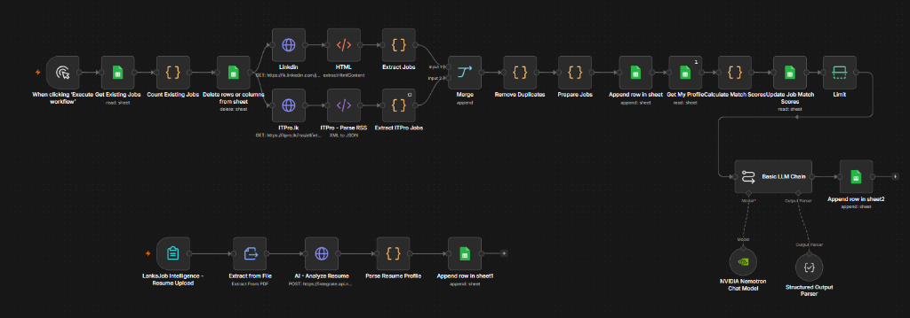
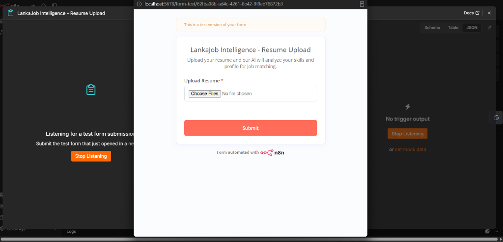
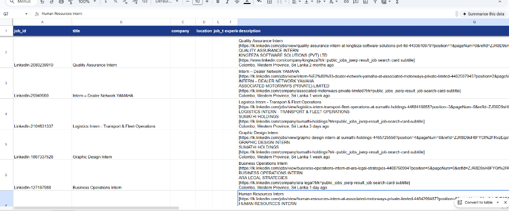
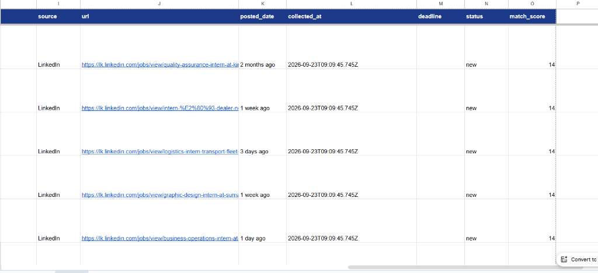

# Workflow Screenshots & Visual Assets

This directory contains real-world execution screenshots demonstrating the **AI Job Matching Automation** system in operation.

---

## Included Screenshots

### 1. Workflow Canvas Overview (`workflow-overview.png`)
**Canvas Architecture & Execution Pipeline:**
Displays the dual-pipeline n8n canvas:
- **Upper Pipeline:** Automated job extraction (LinkedIn & ITPro.lk), XML/HTML parsing, deduplication, hash-based ID generation, Google Sheets synchronization, weighted algorithmic scoring, and LangChain integration with NVIDIA Nemotron LLMs.
- **Lower Pipeline:** Webhook form trigger, PDF text extraction, NVIDIA Nemotron 30B resume parsing, profile restructuring, and saving to Google Sheets.

---

### 2. Candidate Resume Ingestion Form (`resume-upload-form.png`)
**Interactive Candidate Ingestion Interface:**
The n8n Form Trigger interface where candidates submit their PDF resume. n8n catches the binary payload and initiates automated parsing and profiling.

---

### 3. Discovered Job Opportunities (`job-results.png`)
**Google Sheets Job Extraction (`Jobs` Tab - Core Attributes):**
Demonstrates populated columns including:
- `job_id` (deterministic 32-bit hash identifier)
- `title` (standardized job title)
- `company` & `location`
- `job_type` & `experience_level`
- `description`

---

### 4. Algorithmic Match Scoring & Verification (`job-match-scores.png`)
**Google Sheets Algorithmic Scoring (`Jobs` Tab - Scoring & Verification):**
Demonstrates populated columns including:
- `source` (LinkedIn / ITPro.lk)
- `url` (direct application link)
- `posted_date` & `collected_at` timestamps
- `status` (`new`)
- `match_score` (computed 0–100 weighted fit score)

